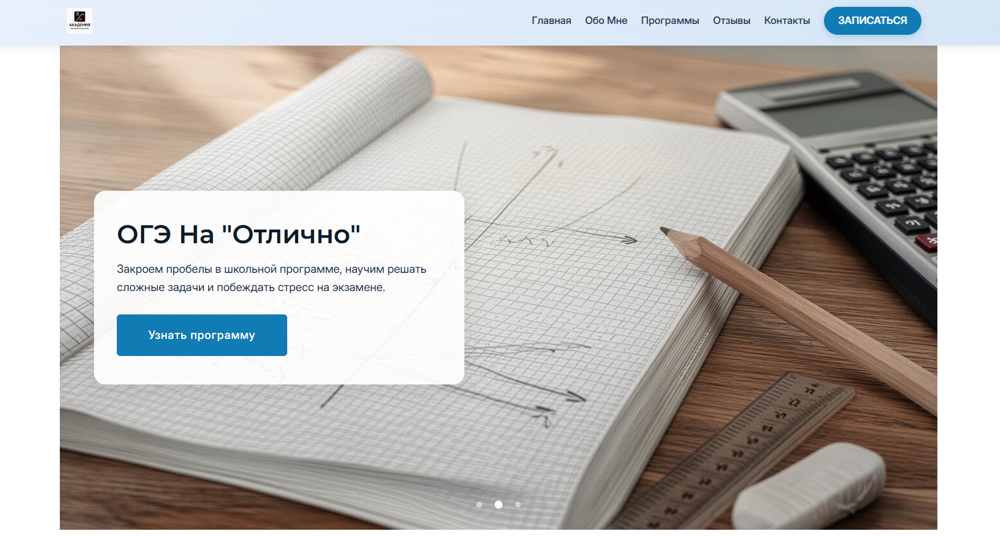
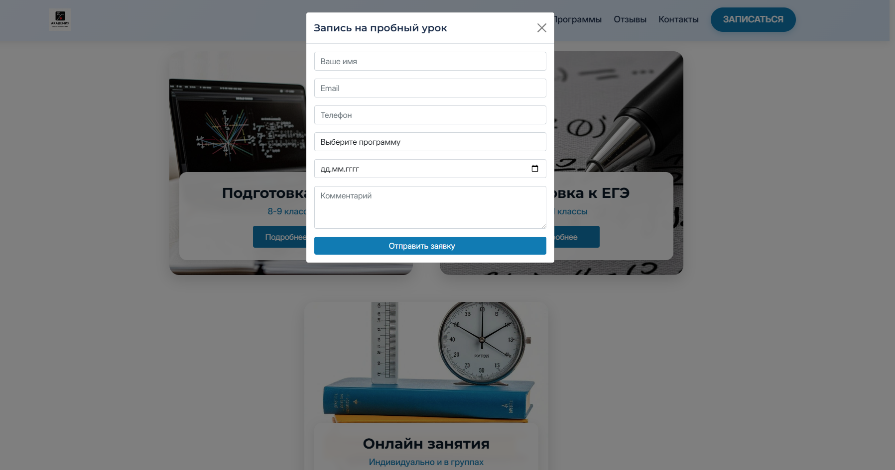
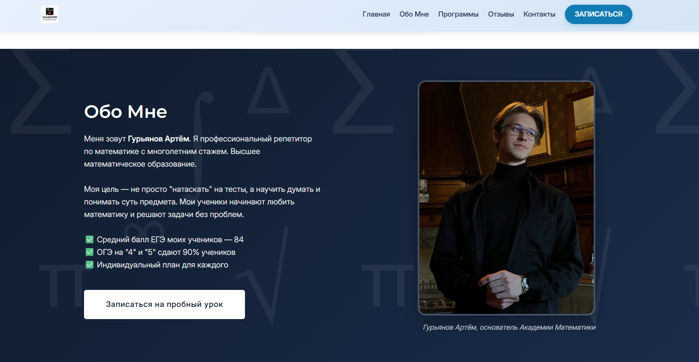

# 🎓 Math Mentor — Сайт репетитора по математике

**Math Mentor** — это современный лендинг для репетитора по математике, специализирующегося на подготовке к **ЕГЭ** и **ОГЭ**. Сайт включает в себя блог с полезными статьями, формы обратной связи и записи на пробный урок.

---

## 📸 Скриншоты

### Главный экран

### Форма записи на пробный урок

### Обо мне

---

## 🚀 Что мы сделали

### Фронтенд (Frontend)
- **Адаптировали готовый HTML-шаблон** `Urban - T-Shirt Store` под тематику репетитора по математике.
- **Заменили весь контент**: тексты, изображения, цветовую схему.
- **Создали дополнительные страницы**:
  - `/blog` — список всех статей.
  - `/blog/article-1`, `/blog/article-2`, `/blog/article-3` — полноценные статьи с полезным контентом.
- **Добавили формы**:
  - Подписка на рассылку (в футере).
  - Запись на пробный урок (модальное окно).
- **Интегрировали социальные сети**: Telegram, ВКонтакте, YouTube, WhatsApp.

### Бэкенд (Backend)
- **Написали сервер на FastAPI** (Python):
  - Раздача статических файлов (HTML, CSS, JS, изображения).
  - API-эндпоинты для обработки форм.
  - Логирование заявок в файлы.
  - CORS для безопасного взаимодействия с фронтендом.
- **Настроили маршрутизацию** для SPA-подобного поведения.

### Деплой
- **Упаковали проект в Docker**:
  - `Dockerfile` для сборки образа.
  - `docker-compose.yml` для удобного локального запуска.
- **Подготовили к хостингу** на Render, Railway или VPS.

---

## 🛠️ Технологии

| Категория | Технологии | Для чего использовали |
|:---|:---|:---|
| **Бэкенд** |   | Обработка запросов, API, раздача статики |
| **Фронтенд** |    | Структура, стили, интерактивность |
| **Библиотеки** |    | Сетка, слайдеры, анимации |
| **Контейнеризация** |  | Упаковка приложения для деплоя |
| **Шрифты** | Google Fonts (Inter, Montserrat) | Типографика |

---
